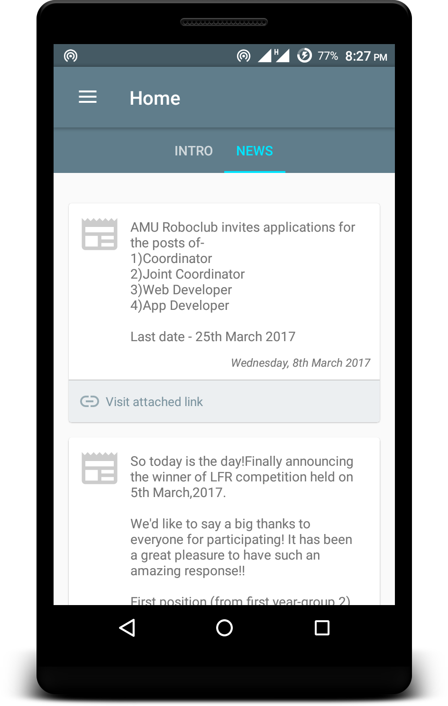
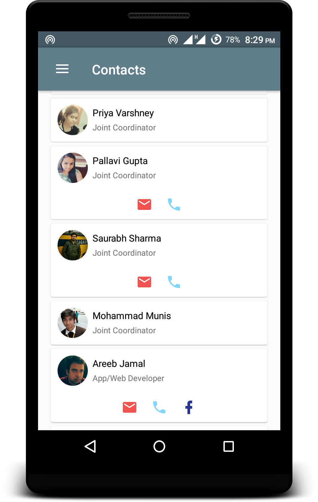
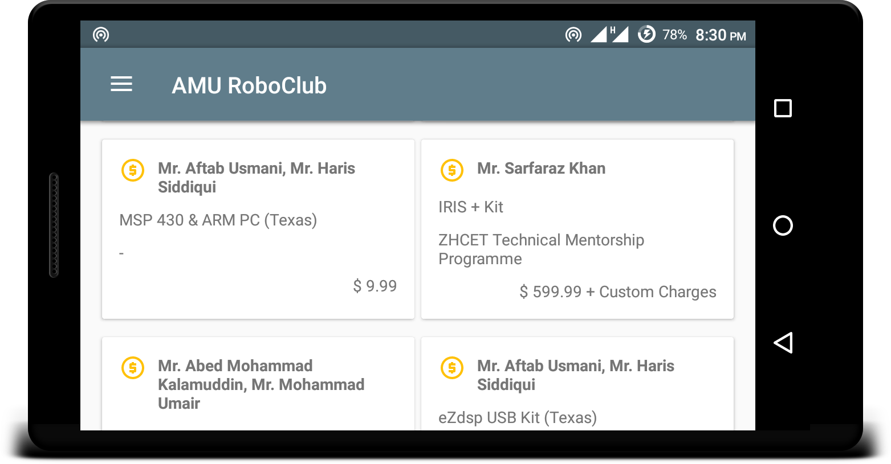
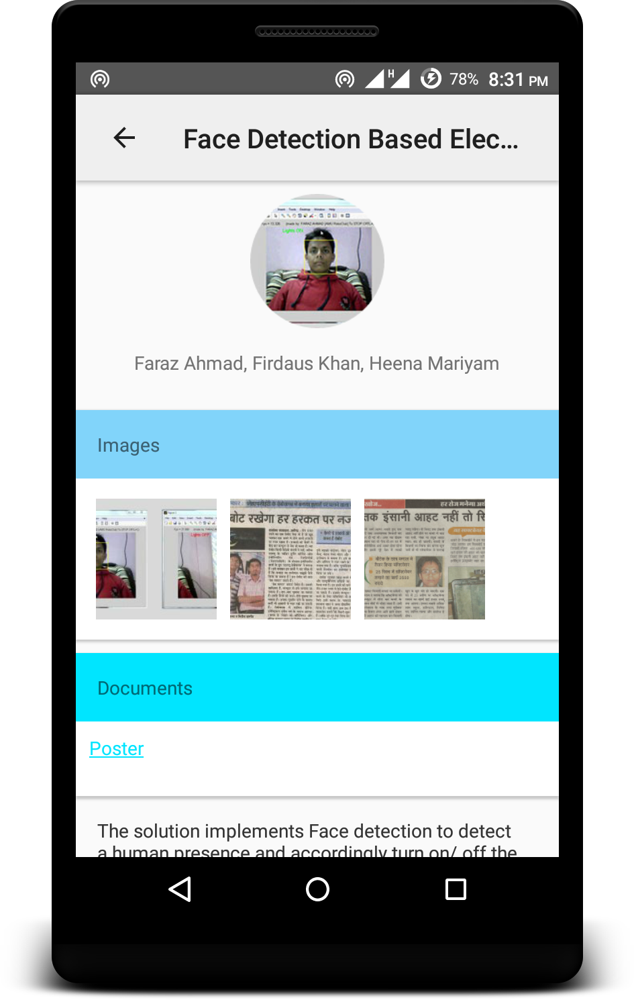
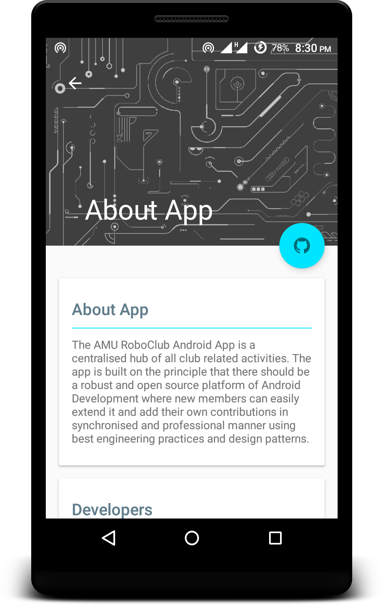

# Roboclub AMU

  
> AMU RoboClub Notification and Club Intro Android App  

  
App's data is updated in real time, requiring no polling or app update as data changes.

App provides following sections :
- **Intro** : Introduction to club
- **News** : Latest News and Announcements from Club Managers
- **Projects** : List of completed and uncompleted projects
- **Contacts** : Contact information of Club Team Members
- **Contributions** : A tribute section to people who contributed to the club

### Screenshots
  
  

### Author
[@iamareebjamal](https://github.com/iamareebjamal)  
[@divs4debu](https://github.com/divs4debu)
